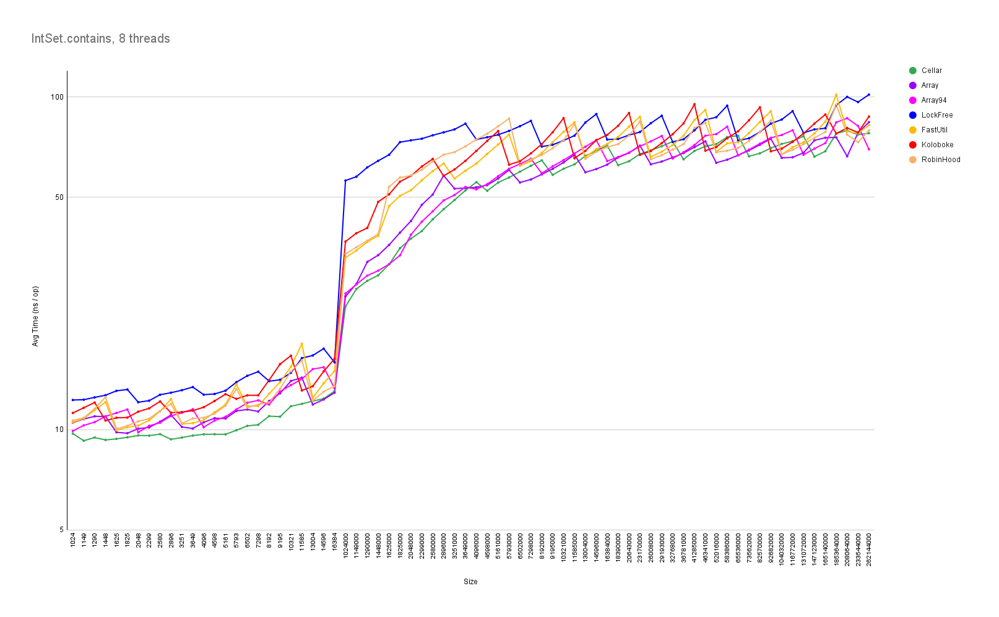
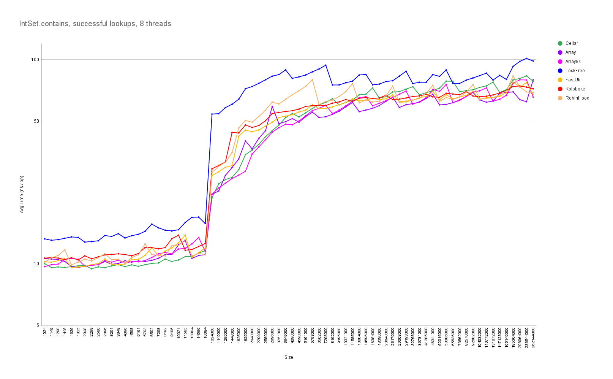
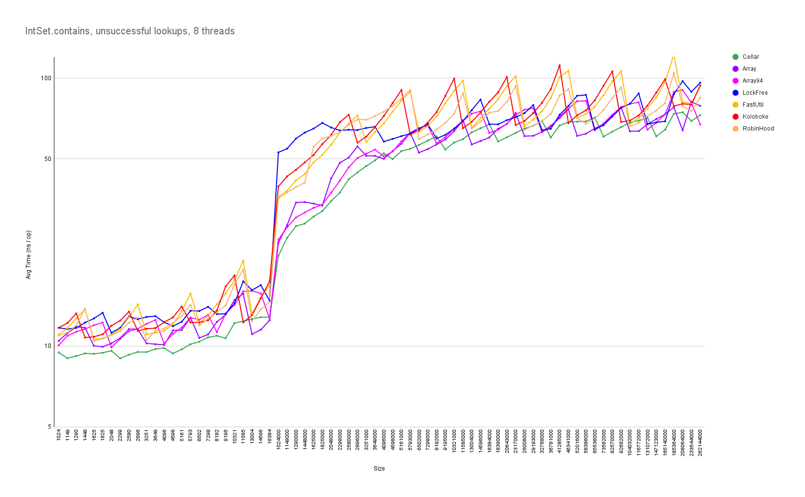
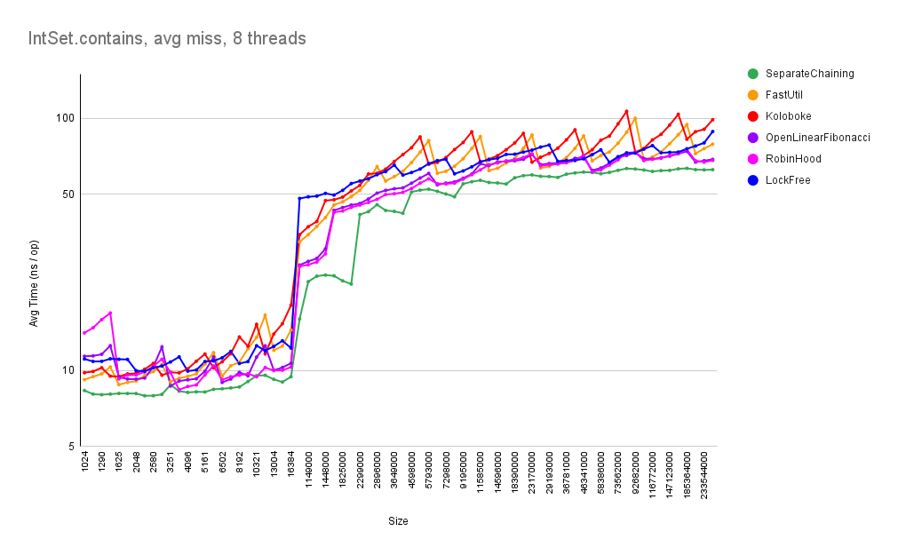
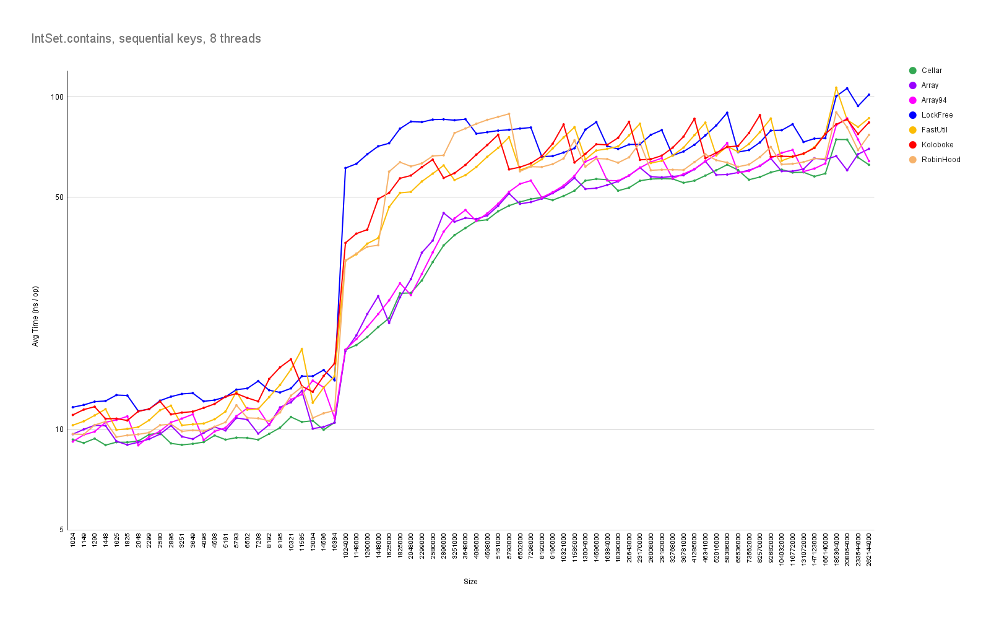
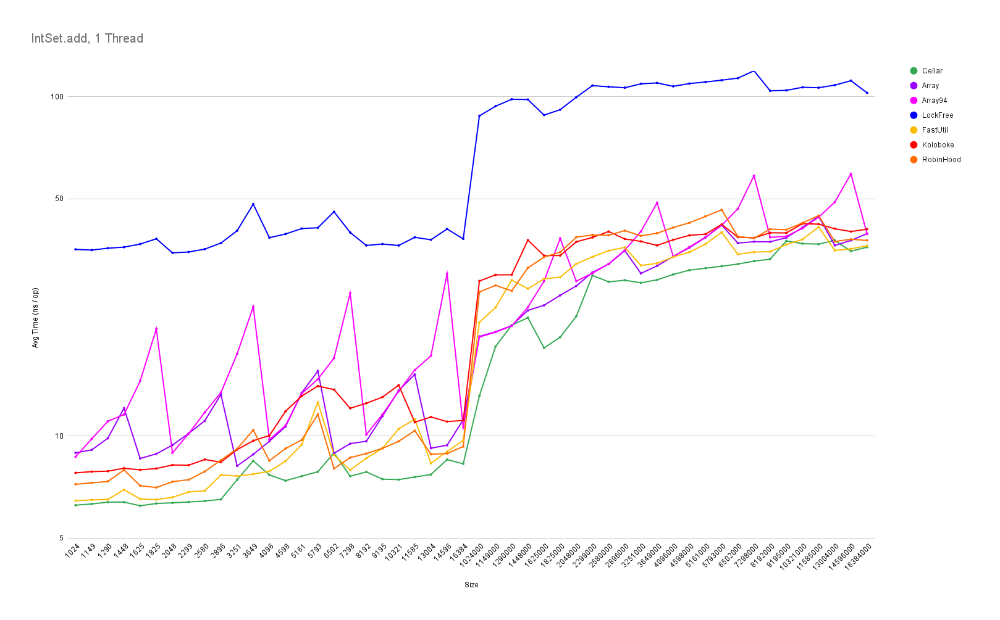
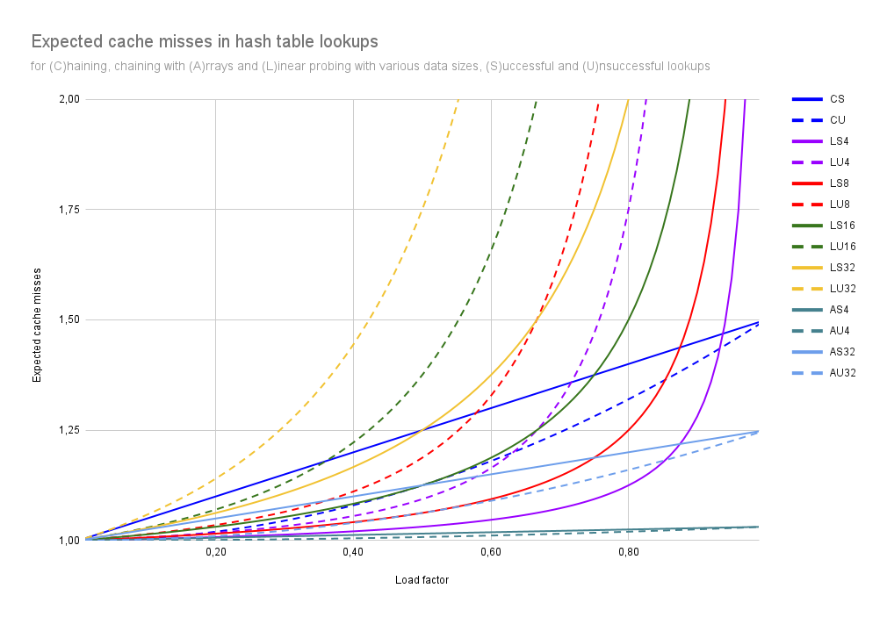

# The Open Addressing Performance Hoax

## The Problem

In recent years, there have been a lot of blog posts claiming that open addressing with linear probing has better performance than separate chaining due to better cache locality. These articles typically pick a general purpose, node-based separate chaining hash table implementation that supports all kinds of key / value types (e.g. some standard library implementation). This is then compared to a specialized DIY open addressing hash table that can only handle integers.

When designing array-based data structures (such as array-based lists, b-trees or hash tables), one of the fundamental design decisions is whether the data should (or rather: can) be stored by value or by reference. This largely depends on the nature of the data. Variable-sized data such as strings obviously cannot be stored by value at all, as an array uses a fixed amount of memory per index. Storing fixed-size data by value improves locality of reference, because no pointers need to be dereferenced to access the data. However, if the data is much larger than a pointer, empty array elements waste a lot of space. Additionally, when reorganizing the data structure (sorting, sorted insert, balancing a tree, rehashing etc.), all the data needs to be moved around (instead of just rearranging pointers). Therefore, storing data by value only makes sense if the data is small and of fixed size.

Incidentally, the data storage design decision (by value or by reference) is completely independent of the collision resolution strategy of a hash table. It is possible to build separate chaining hash tables that store the data by value, as well as open addressing hash tables that store pointers to the data.

Thus, comparing open addressing by value hash tables with separate chaining by reference hash tables is pretty pointless - needless to say that any conclusions about the performance of collision resolution strategies drawn from such tests are completely invalid.

## The Reality

To somewhat level the playing field, I have written two separate chaining hash tables that store 32 bit integer keys by value.

### Separate chaining using a Cellar

The first one stores collisions in a separate collision area, or "cellar" (Williams, Handling identifies as internal symbols in language processors, CACM vol. 2 no. 6, 1959). As buckets stay separate, keys can be abbreviated to make room for the link fields (Knuth, The Art of Computer Programming vol. 3, 2nd ed., 1998, 6.4 exercise 13, p.551). The link values 0 and -1 (all 1 bits) serve as sentinels to indicate an empty slot or end of chain, respectively. The hash table has no fixed max load factor, it simply resizes if the collision area is full. The default size of the collision area is 0.375 (3/8) of the table size, which corresponds to a max load factor of ~1 for uniformly distributed keys.

The techniques used in this implementation have been well known and documented for at least 25 years. I coudn't get hold of the 1973 edition of Knuth's book, but I suspect that the key abbreviation trick was described there already - which would make it 50 years...

### Separate chaining using Arrays

The second hash table implementation stores buckets continuously in "sub-arrays" of the hash table at or after the bucket index. E.g. if the bucket at index 10 has two entries, they are stored in slots 10 and 11. If the bucket at index 11 also has entries, they are stored starting at slot 12. As buckets stay separate, keys can be abbreviated to make room for an 'end-of-chain' bit that indicates whether an entry is the last of its bucket, and an 'offset' field which stores the offset of the start of the bucket. In the example above, slot 11 would have offset == 1 because bucket #11 starts at slot 12. The default load factor of the hash table is 0.75, however, in contrast to open addressing, using higher load factors such as 0.9375 (15/16) doesn't significantly affect performance.

This implementation is similar to the array hash table described by Askitis / Zobel in "Cache-Conscious Collision Resolution in String Hash Tables" (2005), only that there are no separately allocated arrays per bucket, but the arrays are stored flatly within the hash table. There are also similarities with robin hood hashing: The entries are stored at exactly the same locations as with robin hood hashing, however, robin hood hashing needs to probe to find the start of a bucket, while this implementation knows the start of the bucket from the offset.

### Benchmarks

These separate chaining hash tables are benchmarked against the integer hash sets from the FastUtil and Koloboke libraries (both using open addressing with stride one linear probing). Furthermore, I've added my own (rather incomplete) open addressing implementations, using multiplicative hashing as suggested by Knuth (The Art of Computer Programming vol. 3, 2nd ed., 1998, 6.4, p.528), as well as an implementation of robin hood hashing. The last contestant is based on my LockFreeHashTable (i.e. a lock free separate chaining hash table adapted for primitive integers).

#### Lookup Performance

The benchmarks show that overall lookup performance of both separate chaining variants presented here is about 10 % better than the fastest open addressing schemes. Successful lookup performance is about the same, while unsuccessful lookups are significantly faster in separate chaininig variants. Similarly, lookup performance using random keys is about the same, while looking up sequential keys is significantly faster with separate chaining. The lock free separate chaining version is only about 15 % slower than open addressing (while allowing thread safe concurrent updates!).

#### Insertion performance

The separate chaining version using a cellar offers the best insertion performance. The array variant is comparatively slow for small tables, as it uses a more complex insertion algorithm (the current implementation requires up to three passes over the entries following the hash location, so there's probably still room for optimization). Large tables are unaffected by this, as memory latency is the limiting factor here. Naturally, the version with a max load factor of 0.9375 spends more time finding free spots when the table is nearly full.

#### Memory Consumption

The array variant at load factor 0.9375 uses the least amount of memory on average (6.3 bytes per entry), followed by the cellar version (7.5 bytes per entry). Most open addressing schemes and the default array version use a load factor of 0.75, which amounts to 7.8 bytes per entry. Koloboke is the only open addressing variant with a lower load factor, using 8.7 bytes per entry. The lock free version uses 12.8 bytes, as it needs to maintain two pointers per entry.

In comparison, `java.util.HashSet<Integer>` requires ~56 bytes per entry.

### Conclusion

These measurements suggest that the notion that open addressing is faster than separate chaining is false. In particular, the cache locality benefit attributed to open addressing with linear probing cannot be observed in practice.

Apart from its performance and size benefits, separate chaining offers a lot of other desirable properties, such as less variance in performance (successful vs. unsuccessful lookups, before vs. after resize), resilience to non-uniform hashes, resilience to hash collision attacks (only one bucket is affected), straightforward delete implementation etc..

## The Theory

Even in theory, the cache locality benefit of open addressing is mediocre at best and deteriorates quickly with the size of the data. The expected probe counts for successful and unsuccessful lookups for separate chaining and linear probing can be calculated using formulas from Knuth's book (The Art of Computer Programming vol. 3, 2nd ed., 1998, 6.4, p.525 and p.528). For separate chaining using linked lists (e.g. the cellar version), each probe can be assumed to be a cache miss. For linear probing and separate chaining using arrays, the expected cache misses can be calculated based on probe count, data size and cache line size as follows:

$$
\small CacheMisses := \frac{ProbeCount \times DataSize + CacheLineSize - Alignment}{CacheLineSize}
$$

With a cache line size of 64 and alignment equal to the data size, the resulting graphs show that linear probing with as few as 16 bytes of data per entry produces more cache misses than separate chaining with linked lists for typical load factors. For separate chaining with arrays, the expected cache misses are very close to 1 (as the expected probe count is at most 1.5).

## Related Work

Maybe the confusion started in 2009 with an article by Askitis, "Fast and Compact Hash Tables for Integer Keys". This article compares linear probing with by-value storage with several separate chaining variants, all of which use by-reference storage (i.e. the hash table stores pointers to linked nodes, or to an array of entries, or to a cluster of nodes). Separate chaining with by-value storage is not considered. Unsurprisingly, linear probing is found to be the fastest of the methods, although not without problems: "Despite its impressive performance, linear probing has poor worst-case performance and as a consequence, it can become a slow hash table to use."

In 2015, Liu and Xu's article "Comparison of Hash Table Performance with Open Addressing and Closed Addressing: An Empirical Study" concludes that "Linear probing is not a really feasible variant in general." The article uses string keys of various lengths, so it can be assumed that all tested hash tables including linear probing use by-reference storage.

In 2018, Malte Skarupke presented "A new fast hash table in response to Google’s new fast hash table". His `ska::bytell_hash_map` uses separate chaining in a flat array (i.e. by-value storage), which he found to be faster than google's SwissTable and on par with his own variant of robin hood hashing.

Sergey Kuksenko's 2020 article "Inline types and HashMap performance analysis." compares Java's standard HashMap to separate chaining and open addressing hash tables with by-value storage, using project valhalla's new value classes (= inline classes). Bottom line is that open addressing with linear probing is generally slower than the current separate chaining by-reference HashMap. "Reference based map has more cache misses when doing dereference to Entry, inline based map has more cache misses when walking to the table itself. Overall amount of cache misses is unchanged."

The article "A tale of Java Hash Tables" from 2021 describes Andrei Ciobanu's attempts to beat Java's separate chaining HashMap using several open addressing variants, all using by-reference storage: "I am yet to find an Open Addressing implementation that outperforms HashMap<K,V> by a significant margin."
