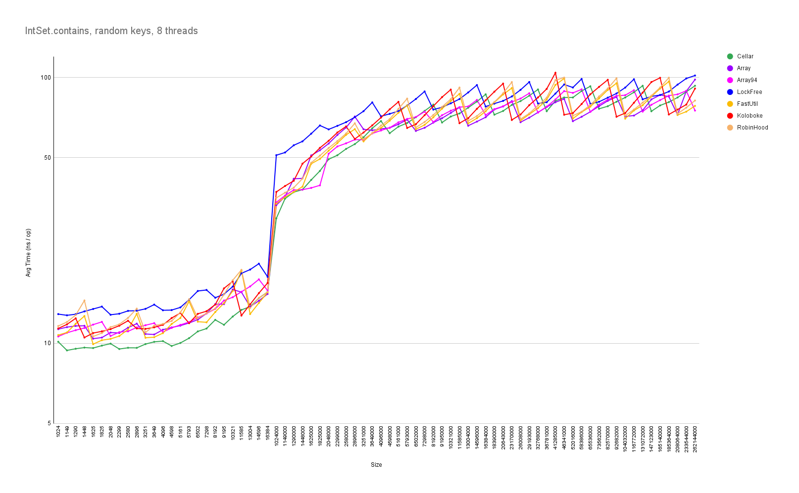

# The Open Addressing Performance Hoax

## The Problem

In recent years, there have been a lot of blog posts claiming that open addressing with linear probing has better performance than separate chaining due to better cache locality. These articles typically pick a general purpose, node-based separate chaining hash table implementation that supports all kinds of key / value types (e.g. some standard library implementation). This is then compared to a specialized DIY open addressing hash table that can only handle integers.

When designing array-based data structures (such as array-based lists, b-trees or hash tables), one of the fundamental design decisions is whether the data should (or rather: can) be stored by value or by reference. This largely depends on the nature of the data. Variable-sized data such as strings obviously cannot be stored by value at all, as an array uses a fixed amount of memory per index. Storing fixed-size data by value improves locality of reference, because no pointers need to be dereferenced to access the data. However, if the data is much larger than a pointer, empty array elements waste a lot of space. Additionally, when reorganizing the data structure (sorting, sorted insert, balancing a tree, rehashing etc.), all the data needs to be moved around (instead of just rearranging pointers). Therefore, storing data by value only makes sense if the data is small and of fixed size.

Incidentally, the data storage design decision (by value or by reference) is completely independent of the collision resolution strategy of a hash table. It is possible to build separate chaining hash tables that store the data by value, as well as open addressing hash tables that store pointers to the data.

Thus, comparing open addressing by value hash tables with separate chaining by reference hash tables is pretty pointless - needless to say that any conclusions about the performance of collision resolution strategies drawn from such tests are completely invalid.

## The Reality

To somewhat level the playing field, I have written a separate chaining hash table that stores 32 bit integer keys by value. Collisions go into a separate collision area, or "cellar" (Williams, Handling identifies as internal symbols in language processors, CACM vol. 2 no. 6, 1959). As buckets stay separate, keys can be abbreviated to make room for the link fields (Knuth, The Art of Computer Programming vol. 3, 2nd ed., 1998, 6.4 exercise 13, p.551). The link values 0 and -1 (all 1 bits) serve as sentinels to indicate an empty slot or end of chain, respectively. The hash table has no fixed max load factor, it simply resizes if the collision area is full. The default size of the collision area is 0.375 (3/8) of the table size, which corresponds to a max load factor of ~1 for uniformly distributed keys.

This simple separate chaining hash table is benchmarked against the integer hash sets from the FastUtil and Koloboke libraries (both using open addressing with stride one linear probing). Furthermore, I've added my own (rather incomplete) open addressing implementation, using multiplicative hashing as suggested by Knuth (The Art of Computer Programming vol. 3, 2nd ed., 1998, 6.4, p.528), as well as an implementation of robin hood hashing. The last contestant is based on my LockFreeHashTable (i.e. a lock free separate chaining hash table for primitive integers).

The benchmarks show that the simple separate chaining version is significantly faster than all the other contestants, while using slightly less memory than the open addressing schemes. The lock free separate chaining version uses about twice the memory, yet for big hash tables (> 4 million entries), lookups keep up quite well with the open addressing variants (while allowing thread safe concurrent updates!).

These measurements suggest that the notion that open addressing is faster than separate chaining is false. In particular, the cache locality benefit attributed to open addressing with linear probing cannot be observed in practice.

The good performance of the simple separate chaining hash table could be explained by the fact that the large, sparsely filled hash table is accompanied with a comparatively small, densely packed collision area. In relation to its size, the collision area is accessed up to twice as often as the main hash table, so that it is likely to stay in cache. Thus, collisions are essentially free with respect to cache misses.

This is in addition to other desirable properties of separate chaining, such as less variance in performance (successful vs. unsuccessful lookups, before vs. after resize), resilience to non-uniform hashes, resilience to hash collision attacks (only one bucket is affected), straightforward delete implementation etc..

## The Theory

Even in theory, the cache locality benefit of open addressing is mediocre at best and deteriorates quickly with the size of the data. The expected probe counts for successful and unsuccessful lookups for separate chaining and linear probing can be calculated using formulas from Knuth's book (The Art of Computer Programming vol. 3, 2nd ed., 1998, 6.4, p.525 and p.528). For separate chaining, each probe can be assumed to be a cache miss. For linear probing, the expected cache misses can be calculated based on probe count, data size and cache line size as follows:

$$
\small CacheMisses := \frac{ProbeCount \times DataSize + CacheLineSize - Alignment}{CacheLineSize}
$$

With a cache line size of 64 and alignment equal to the data size, the resulting graphs show that linear probing with as few as 16 bytes of data per entry produces more cache misses than chaining for typical load factors. 

## Related Work

Maybe the confusion started in 2009 with an article by Askitis, "Fast and Compact Hash Tables for Integer Keys". This article compares linear probing with by-value storage with several separate chaining variants, all of which use by-reference storage (i.e. the hash table stores pointers to linked nodes, or to an array of entries, or to a cluster of nodes). Separate chaining with by-value storage is not considered. Unsurprisingly, linear probing is found to be the fastest of the methods, although not without problems: "Despite its impressive performance, linear probing has poor worst-case performance and as a consequence, it can become a slow hash table to use."

In 2015, Liu and Xu's article "Comparison of Hash Table Performance with Open Addressing and Closed Addressing: An Empirical Study" concludes that "Linear probing is not a really feasible variant in general." The article uses string keys of various lengths, so it can be assumed that all tested hash tables including linear probing use by-reference storage.

In 2018, Malte Skarupke presented "A new fast hash table in response to Google’s new fast hash table". His `ska::bytell_hash_map` uses separate chaining in a flat array (i.e. by-value storage), which he found to be faster than google's SwissTable and on par with his own variant of robin hood hashing.

Sergey Kuksenko's 2020 article "Inline types and HashMap performance analysis." compares Java's standard HashMap to separate chaining and open addressing hash tables with by-value storage, using project valhalla's new value classes (= inline classes). Bottom line is that open addressing with linear probing is generally slower than the current separate chaining by-reference HashMap. "Reference based map has more cache misses when doing dereference to Entry, inline based map has more cache misses when walking to the table itself. Overall amount of cache misses is unchanged."

The article "A tale of Java Hash Tables" from 2021 describes Andrei Ciobanu's attempts to beat Java's separate chaining HashMap using several open addressing variants, all using by-reference storage: "I am yet to find an Open Addressing implementation that outperforms HashMap<K,V> by a significant margin."
