# LockFreeHashTable

LockFreeHashTable is a new (AFAICT) non-blocking, cache-conscious hash table design. It comes with a reference implementation in Java and a bunch of benchmarks. It has *not* been widely tested yet (apart from unit-tests and the benchmarks), so (as usual with FOSS) use at your own risk.


## Features

* Progress guarantees
	* read operations are wait free population oblivious
	* update operations are lock free
* Low memory footprint
* Very high lookup performance
* Reference implementation in Java
	* Core hash table algorithm separate from Map / Set implementations
	* Map implementation supports null keys and values (i.e. can be used as drop-in replacement for HashMap)
	* Map / Set implementations support Serializable and Clonable
	* Dedicated Set implementation (not based on Map, i.e. no wasted memory due to unused value fields)
	* Allows overriding `hashCode` and `equals` methods


## Motivation

I strongly believe that we need good, small and fast thread safe data structures in the future. CPUs don't get any faster, only more parallel. Developers should not have to choose between slow, thread safe vs. fast, single threaded data structures. To that end, this project presents a hash table that is both fast and thread safe.

Another issue I see is that standard APIs are sometimes too tightly coupled to their implementation, thus complicating or even prohibiting its use in an application. E.g. Java's HashMaps don't allow customizing the `hashCode` and `equals` functions, nor the `Map.Entry` objects. Implementing a case-insensitive (or even accent-insensitive) set of strings is not possible in Java without writing your own `Map` implementation (violating the API) or building wrapper objects with the desired properties (paying API conformity with additional memory indirections / cache misses). The Infinispan project maintained their own copy of `ConcurrentHashMap` for years, just to be able to inject cache control fields into the `Map.Entry` objects without wrappers. Similarly, the C++ `std::unordered_map` basically requires separately allocated node objects, thus prohibiting most cache friendly memory layouts (not just open addressing!). This project intentionally separates the core hash table implementation from the API implementation, thus making it relatively easy to build your own, specialized `Map` or `Set`.


## What's New

`LockFreeHashTable` uses a new memory layout that optimizes performance by minimizing cache misses (or maximizing locality of reference).

The hash table uses separate chaining for [best performance](OpenAddressingPerformance.md) and because there are well known lock-free algorithms to manage linked lists.

Instead of dynamically allocating nodes on the heap, the hash table uses a pre-allocated array of entry structures. Thus an entry can be addressed via array index rather than a full-sized pointer.

To minimize cache misses, the actual hash table (i.e. the array of pointers to the list heads) is interleaved with the entry array. The insertion algorithm tries to place new entries at or near their hash location. Thus, in the common case, finding an entry only needs to access a single memory location / cache line.

This is similar to coalesced chaining, except that an extra head pointer is used to prevent buckets from coalescing.


## Data Structure Details

In pseudo-C, the memory layout could be described as follows:

```
struct Entry {
	union {
	  uint64 state;
		struct {
			uint64 head : log2(tablesize);
			uint64 used : 1;
			uint64 resizing : 1;
			uint64 hash : 32 - log2(tablesize);
			uint64 next : log2(tablesize);
		}
	};
	Key key;
	Value value;
};

Entry[] hashTable;
```

The size of the hash table is always a power of two. The maximum supported table size with this memory layout is 2<sup>30</sup> (larger hash tables could be built using segmentation).

The `state` field is a 64 bit value that can be atomically updated using single word CAS or LL/SC instructions. It consists of the following bit fields:
* `head`: Index of the list head of this bucket. The values 0 and 1 are reserved and mean "none" and "removed", respectively. This implies that etries 0 and 1 of the hash table are also reserved, as they cannot be addressed by the `head` and `next` fields.
* `used`: 1 indicates that the entry stores valid data. 0 indicates that the entry is either empty (with `hash == 0`) or has been removed (`hash != 0`).
* `resizing`: 1 indicates that the entry is currentrly being transferred to a new hash table and must not be modified, i.e. a thread that wishes to update the entry's state should participate in the resizing / rehashing process and then update the entry of the new hash table.
* `hash`: The remainder of the hash code, i.e. the bits of the hash code that have not been used as hash address (see Knuth, The Art of Computer Programming vol. 3 section 6.4 exercise 13).
* `next`: Index of the next entry in the chained list, or <= 1 for "end of chain" (see above).

If `Key` and `Value` are small, fixed-sized types (e.g. <= 64 bit values), they can be stored directly in the hash table. Otherwise, references / pointers should be used.

Note: The reference implementation is in Java, which currently does not support arrays of structures (JEP 401 may fix that in the future). In particular, arrays that interleave primitive values with object references are not possible in Java. Therefore, the reference implementation consists of a core implementation that just manages an array of states. Concrete `Set` / `Map` implementations augment this with a parallel array of keys or key-value-pairs, respectively. This unfortunately adds another cache miss / memory access per successful lookup. AFAICT the reference implementation is still faster than all other concurrent hash table implementations available for Java.


## Algorithm Details

The algorithms are based on the lock-free linked-list implementation presented by Timothy L. Harris in "A Pragmatic Implementation of Non-Blocking Linked-Lists", 2001.


### Lookup

1. Calculate the hash code of the lookup key.
2. Load the current hash table (volatile read).
3. Use log<sub>2</sub>(tablesize) bits of the hash code as index into the hash table, keep the remaining bits of the hash code for comparison with the `hash` fields (see below).
4. Load the `head` field at the hash location as current index.
5. If the current index is 0 or 1, return not found.
6. If the `used` flag at the current index is not set, set the current index to the `next` field and goto 5.
7. If the `hash` field at the current index is greater than the remainder of the lookup hash code, return not found.
8. If the `hash` field at the current index is equal to the remainder of the lookup hash code and the `key` at the current index equals the lookup key, return found (or the `value` at the current index).
9. Set the current index to the `next` field at the current index, goto 5.

Note that in contrast to Harris' "search" algorithm, this algorithm does *not* update the linked lists. In particular, it does not try to unlink entries that have been marked as logically removed. Therefore there is no unbounded retry (as required by Harris' algorithm to find the active previous node). This algorithm requires at most table size steps, thus it is wait-free.


### Update

Updates are based on Harris' "search" algorithm: search for a pair of adjacent active entries "previous" and "current", such that the current entry either matches the lookup key or marks the insertion point (i.e. is the first entry in the chain with hash code greater than the hash code of the lookup key).

If the algorithm encounters a logically removed entry, it "helps" the removing thread to unlink the entry by updating the previous entry's `next` field.

The "search" algorithm may return "none" (0) for either or both the previous and current entries, meaning that the insertion point is at the head or the tail of the bucket's linked list, respectively (or both, if the bucket is empty).

Having a previous and current entry as described above allows us to define three atomic update operations "insert", "remove" and "replace":


#### Insert

1. Search for the previous and current entries (see above).
2. If the current entry matches the insertion key, return `false` (key is already present in the table).
3. Allocate a new entry (see Allocate), if allocation fails, resize the table and retry.
4. Initialize the new entry: store `hash`, `key` and `value`.
5. Set the new entry's `next` field to the index of the current entry (or 0 if there is no current entry).
6. Atomically set `previous.next` to the index of the new entry using CAS.
7. If CAS fails, retry the entire operation.


#### Remove

1. Search for the previous and current entries (see above).
2. If the current entry does not match the key to remove, return false (key is not in the table).
3. Atomically set `current.used := 0` using CAS to mark the entry as logically removed.
4. If CAS fails, retry the entire operation.
5. Optionally: clear `key` and `value` of the current entry (note that the other operations have to be null-safe in this case).
6. Try to set `previous.next := current.next` using CAS, ignoring potential CAS failure (i.e. another thread has already fixed the `previous.next` link).


#### Replace

1. Search for the previous and current entries (see above).
2. If the current entry does not match the key to replace, return false.
3. Allocate a new entry (see Allocate), if allocation fails, resize the table and retry.
4. Initialize the new entry: store `hash`, `key` and `value`.
5. Set the new entry's `next` field to `current.next`.
6. Atomically set `current.used := 0` and `current.next` to the index of the new entry using CAS.
7. If CAS fails, retry the entire operation.
8. Optionally: clear `key` and `value` of the current entry (note that the other operations have to be null-safe in this case).
9. Try to set `previous.next` to the index of the new entry using CAS, ignoring potential CAS failure (i.e. another thread has already fixed the `previous.next` link).


#### Allocate

The Allocate function tries to find and reserve an empty entry for the current thread. This uses a probe sequence starting at the current entry determined by the caller (i.e. the desired insertion point of the new entry). If successful, the caller will typically store `key` and `value` into the allocated entry before linking the entry to the bucket's chain. If allocation fails, the caller will typically have to resize the hash table.

1. Set the probe index to the current index (or the current index + 1 if the entry at the current index is already known to be non-empty).
2. If the entry at the probe index is empty (i.e. all `state` fields except `head` are 0), set the `used` flag using CAS. The `hash` and `next` fields may also be set in the same operation, as they are typically known at this point. If CAS is successful, return the probe index.
3. Optional: If the size of the hash table exceeds the load factor, return 0. Note: depending on the implementation, it is not strictly necessary to check this on every probe iteration. E.g. the reference implementation uses `LongAdder` to track the size, which is fast to update, but quite slow to read. Therefore the table size is only checked once after several failed probe steps.
4. If the hash table is resizing, return 0.
5. If the number of probe steps exceeds the table size, return 0.
6. Calculate the next probe index and goto 2. The reference implementation uses a combination of linear and quadratic probing: It first checks eight entries at / after the current index (which are likely to be in the same cache line), then switches to quadratic probing using triangular numbers.


### Resize

The thread that starts the resize process allocates the new hash table. This may take some time, e.g. on Java, allocation may trigger garbage collection. Thus, other threads joining the resize process begin to mark entries of the old table as "resizing" until the new hash table is allocated.

The entries of the old table are then split evenly across the threads participating in the resizing process. If new threads join the resizing process, the largest remaining region is split in half. Thus the resizing threads operate on separate memory locations as long as possible, minimizing contention. Only at the end of the resizing process will threads converge at the remaining entries, trying to help each other.

Resizing works by copying one bucket at a time. The entries are marked "resizing" and transferred to the new table in the same order they are encountered in the old table. Depending on growth factor, the entries are potentially split onto 2 / 4 / 8 ... buckets of the new table. To achieve this, each resizing thread keeps track of the tails of the target buckets in an array.

For each old entry, the resizing thread reserves an entry in the new table, copies key and value and then links it to the tail of the respective target bucket's chain using CAS. If CAS fails (`tail.next != 0`, i.e. some other thread has already completed transfer of this entry), the reserved entry is freed and the tail index is updated to the entry inserted by the other thread.

After successfully copying the last bucket, the old hash table is replaced with the new one using CAS.

Note: The reference implementation currently does not implement shrinking the table. The algorithm for this would have to copy from 2 / 4 / 8 ... buckets of the old table into a single bucket of the new table, in the order of the entrie's hash codes.


## Benchmarks

The project comes with a set of JMH-based benchmarks to test lookup and insertion performance with a variety of hash table and key implementations. The benchmarks take great care to randomize the order in which keys are allocated, inserted and looked up, to eliminate unwanted cache effects. I've only tested small maps (1k - 16k entries) that should fit in cache and large maps (1M -16M entries) that should not, so beware that there is a dent in all the graphs because data for 16k - 1M entries is missing.

The contestants are:
* LockFree: The `LockFreeHashMap` presented in this project (chaining in flat array)
* Concurrent: Java's `ConcurrentHashMap` (since Java 8) (chaining with nodes)
* ConcurrentV7: Java's first, segmented `ConcurrentHashMap` (Java 5 - 7) (segmented chaining with nodes)
* NonBlocking: Dr. Cliff Click's `NonBlockingHashMap` (open addressing with linear probing)
* FastUtil: fastutil's `Object2ObjectOpenHashMap` (open addressing with linear probing, not thread safe)
* Koloboke: Koloboke's `MutableLHashParallelKVObjObjMap` (open addressing with linear probing, not thread safe)
* SwissTable: Proof of concept of google's SwissTable design in Java (clustered open addressing with linear probing, not thread safe)
* Smoothie: `SmoothieMap`, mainly added for the SwissTable implementation (extendible hashing, not thread safe even for reading)

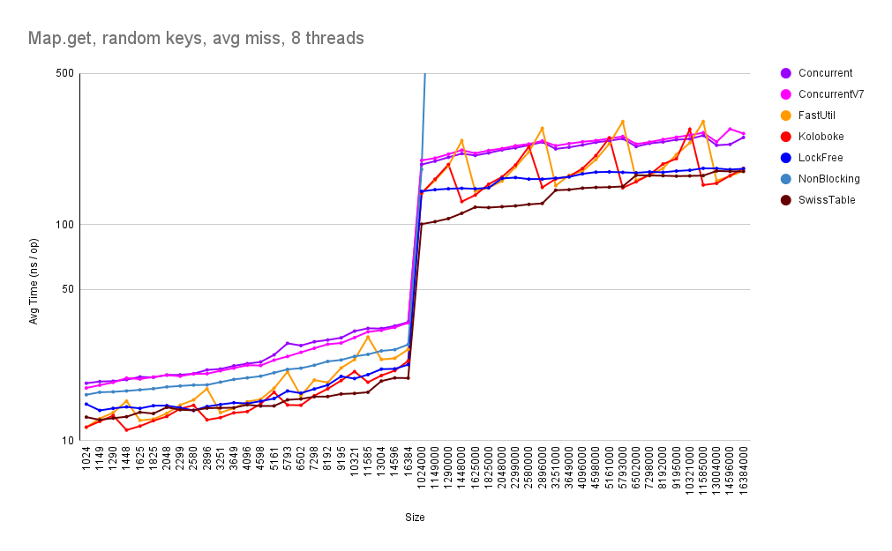

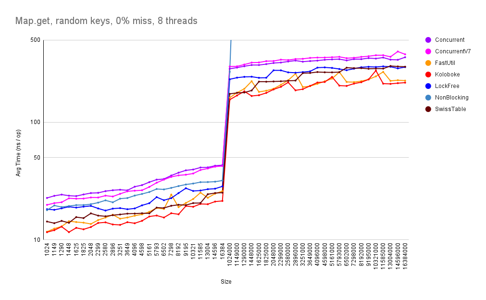

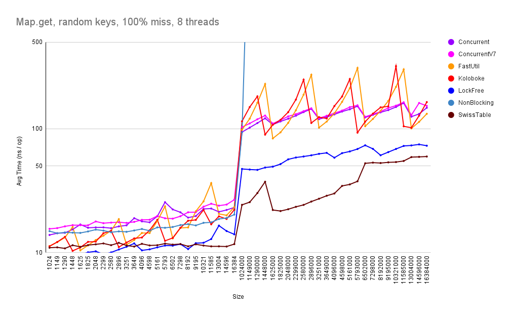

The lookup benchmarks show that the new `LockFreeHashMap` is consistently faster than all other thread safe implementations. The single threaded open addressing implementations are slightly faster for successful lookups. For unsuccessful lookups, only `SwissTable` is faster than the new `LockFreeHashMap`.

Unfortunately, `NonBlockingHashMap` got kicked out for large maps because it was too slow to initialize. Maybe I'll rerun those benchmarks without speed guard.

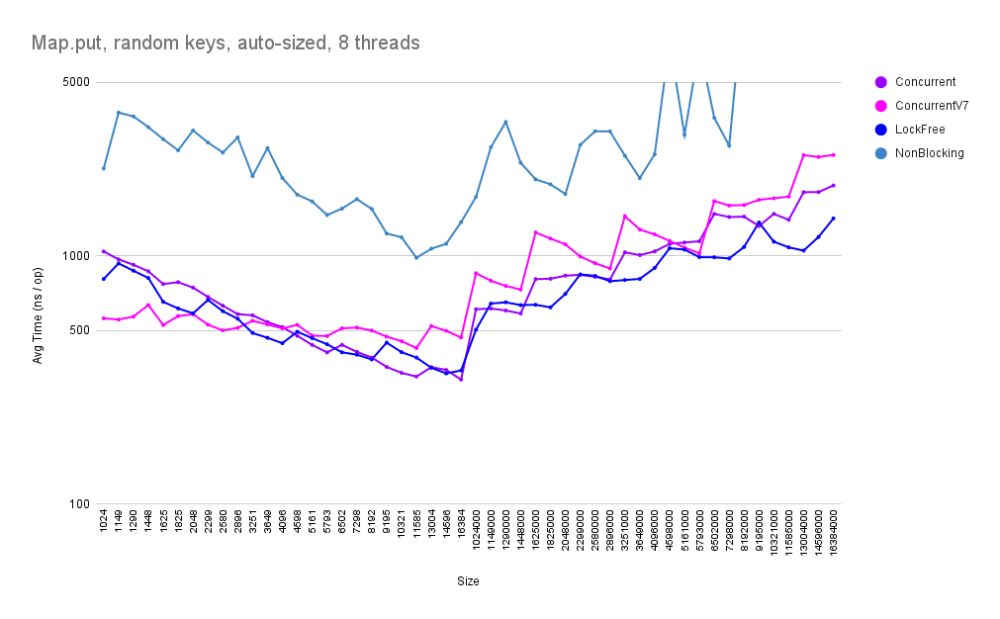

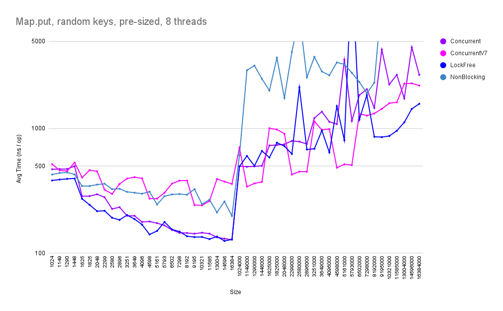

Multi threaded inserts of the new `LockFreeHashMap` are also quite fast, beating the other implemenations at most sizes.

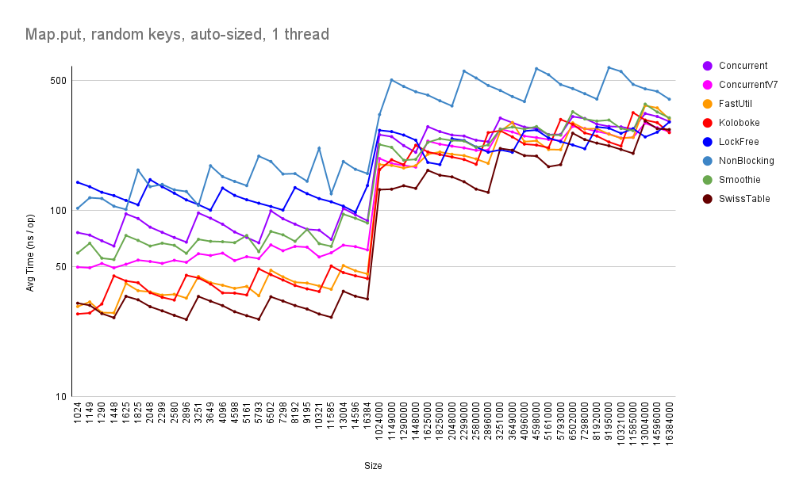

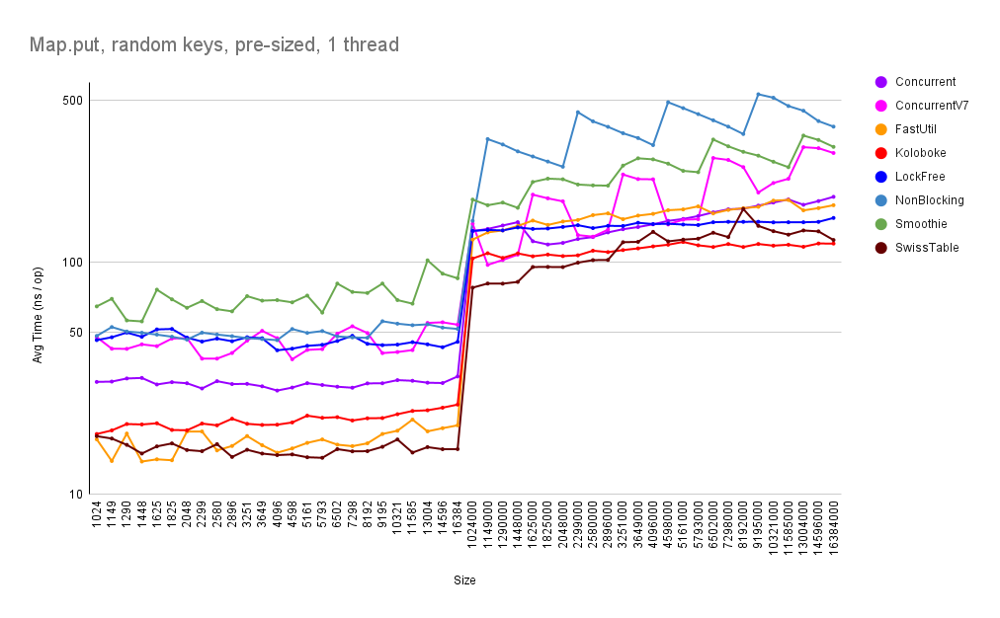

Single threaded insertion performance is mediocre for small tables, but improves for larger table sizes. This is likely due to the higher setup costs of the resizing process, which is optimized for parallel execution and large tables.

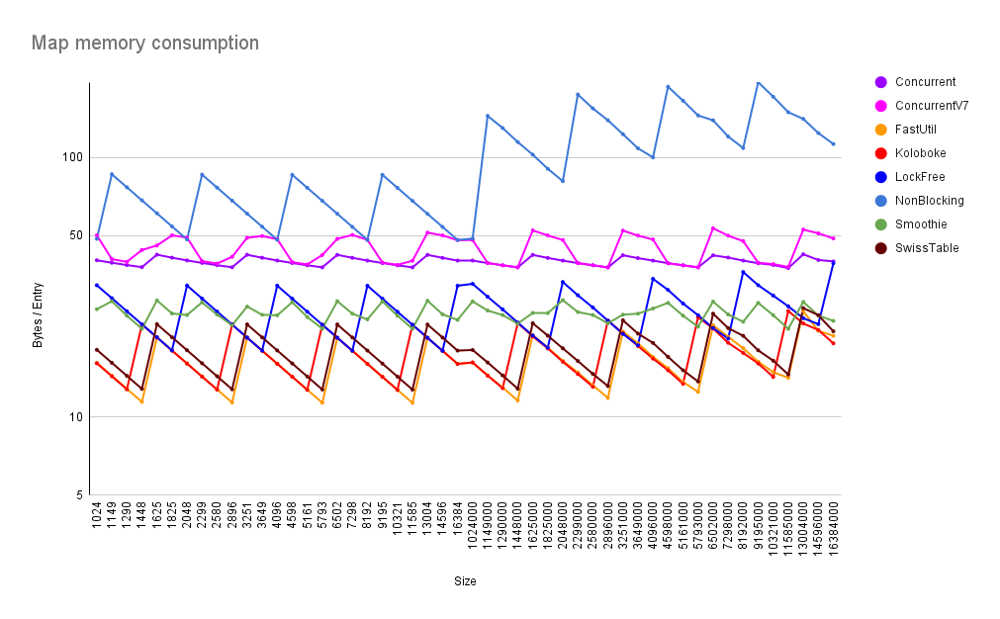

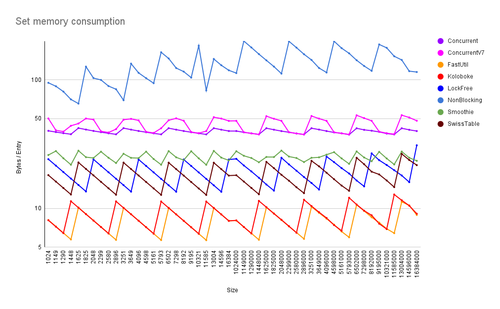

Average memory consumption of `LockFreeHashMap` is just 25 bytes per entry (19 for LockFreeHashSet), compared to 40 for `ConcurrentHashMap`. The open addressing variants (FastUtil and Koloboke) are even smaller with 16 bytes (9 bytes for Sets).

Finally, let's look at some corner cases.

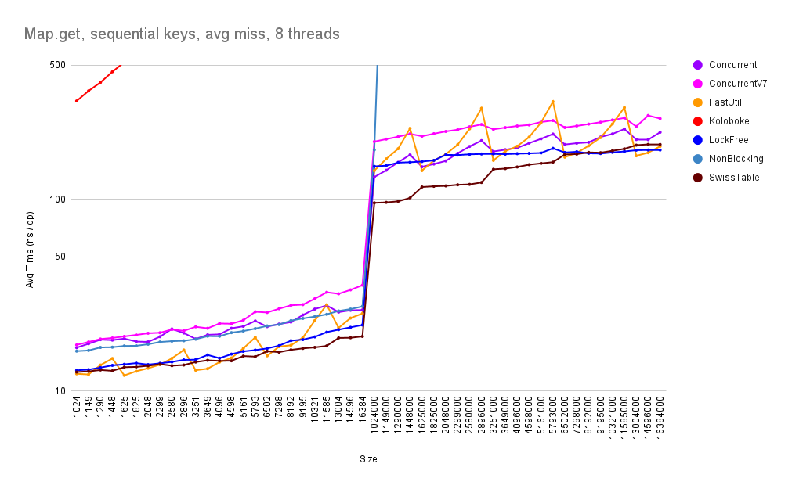

Lookup performance with sequential keys (or rather: key objects with sequential hash codes) is similar to random keys for most hash table implementations, with two notable exceptions: Koloboke is unusably slow because it uses modulo division as hash function, which is known to fail with linear probing and sequential keys. This may just be an oversight, as the primitive map variants of the Koloboke library all scramble the hash codes prior to modulo division. The other exception is `ConcurrentHashMap`, which is ~30% faster than with random keys. This is *also* because it uses modulo division, which in this case (separate chaining) reduces collisions and improves spatial locality.

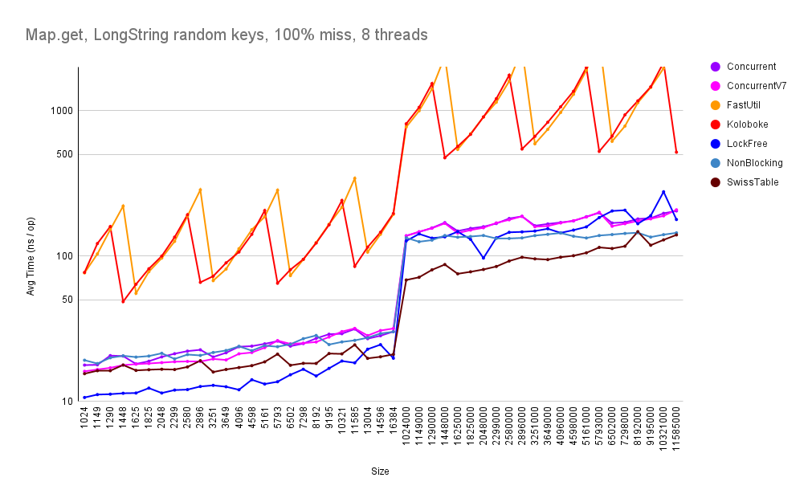

The next benchmark uses long strings (~500 characters) to simulate keys with slow `equals` function, e.g. composite keys that have to walk an object graph in their equals method and thus produce multiple cache misses per comparison. Performance of Koloboke and FastUtil suffers quite badly in this case, especially for unsuccesful lookups. This is because they have to dereference and compare every key in the probe sequence. All other contestants store the hash codes of the keys and thus only need to dereference and compare keys with matching hash code (i.e. ideally none in unsuccessful lookups).

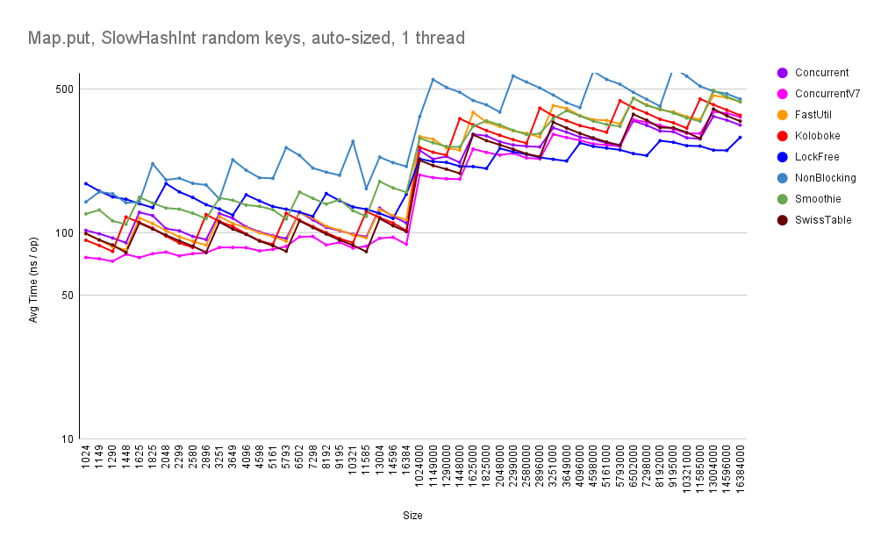

Last but not least, let's look at keys with slow `hashCode` function, again to simulate composite keys that have to walk an object graph to calculate the hash code. This mainly affects insertion performance of implementations that do not store the (full) hash code (FastUtil, Koloboke and SwissTable), because they need to recalculate all hash codes whenever the hash table is resized.


## Future Work

* Implement shrinking
* Try project valhalla's value classes (JEP 401)
* Port to C/C++: I'd really like to know how the LockFreeHashTable compares to google's SwissTable or facebook's F14. I'm reluctant to tackle this project because of the thread safe memory reclamation issue, and my C/C++ is a bit rusty. Maybe I'll start with a simple, single threaded version.
